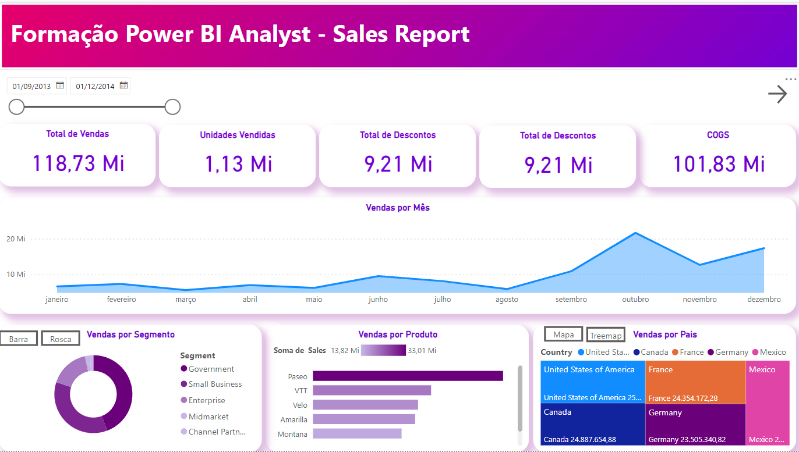
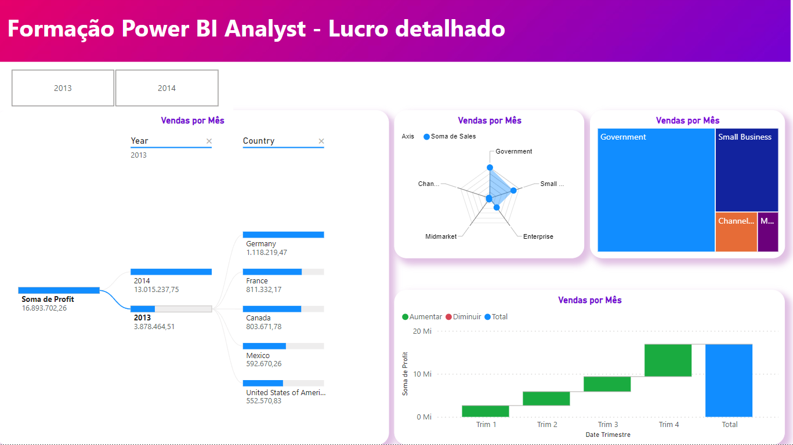

# Analise-de-dados-com-Power-Bi

Este projeto foi montato para testar as capacidades analiticas e desenvolver um DashBoard em Power Bi

# Dados

Os dados utilizados são os disponibilizados pelo próprio Power Bi. - Samples Financials.

# Relatório
Primeira tela do relatório

Segunda tela do relatório

Publicação do relatório no Power BI Service
